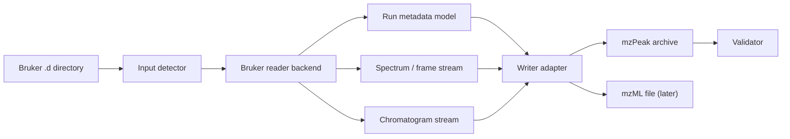

# Architecture

BRFP should be a small converter application around explicit reader and writer
boundaries. The goal is not to invent a new mass-spectrometry data model; it is
to preserve Bruker acquisition content faithfully while writing mzPeak-compliant
output.

## Functional Scope

MVP:

- Detect and inspect Bruker `.d` directories.
- Convert TSF line spectra and classic BAF line/profile spectra to mzPeak.
- Decode supported UV/PDA detector data into standard mzPeak detector facets and
  write Bruker vendor metadata as a proprietary metadata facet when requested.
- Prepare the TDF data path (`analysis.tdf` + `analysis.tdf_bin`) for mzPeak.
- Preserve spectra, ion mobility, DDA-PASEF/DIA-PASEF precursor/window metadata,
  TIC/BPC chromatograms, source file metadata, instrument metadata, software
  metadata, and data-processing provenance.
- Validate mzPeak output against syntactic and semantic invariants.

Post-MVP:

- mzML output.
- TDF production conversion.
- `query` subcommand for spectra by index/native id/time.
- `xic` subcommand for extracted ion chromatograms.
- Cloud/object-store output after local conversion is reliable.

## High-Level Data Flow



## Command Surface

Initial commands:

- `brfp convert <input.d>` converts one input directory.
- `brfp -i=<input.d> -b=<output.mzpeak> -f=mzPeak` is accepted as a
  ThermoRawFileParser-compatible conversion form and is normalized to
  `brfp convert`.
- `brfp inspect <input.d>` reports detected format, frame counts, acquisition
  modes, SDK availability, and output-relevant metadata.
- `brfp validate <output>` validates an mzPeak or mzML file.

Important convert options:

- `-i|--input <path>`: ThermoRawFileParser-style input run.
- `-d|--input_directory <path>`: accepted when the path itself is a Bruker
  `.d`; parent-directory batch conversion is planned.
- `-b|--output <path>`: ThermoRawFileParser-style output file path.
- `-o <dir>`: top-level ThermoRawFileParser-style output directory; inside
  `brfp convert`, use `--output_directory <dir>` for directory output because
  BRFP keeps `-o|--output` as the output-file shorthand.
- `--output <path>`: explicit BRFP output file path.
- `--format mzPeak|mzML|1|2|3|4`: output format. Default: mzPeak. Relevant
  numeric ThermoRawFileParser values are parsed, but only mzPeak spectra output
  is implemented at this stage.
- `-m|--metadata 0|1|2` and `-c|--metadata_output_file <path>`: optional JSON
  or TXT metadata sidecar.
- `--signal-layout chunked|point`: mzPeak data layout. Default: chunked.
- `--chunk-size <mz-width>`: chunk width for chunked mzPeak signal storage.
- `--compression-level <n>`: Zstd compression level for mzPeak.
- `--peak-mode vendor|generic|both|none`: how to treat peak picking.
- `-p|--noPeakPicking` and `-L|--msLevel`: accepted for compatibility; the
  current TSF smoke writer warns that these filters are not applied yet. BAF
  uses these selectors for profile preference and MS-level filtering.
- `--ms-level 1,2`: include selected MS levels for BAF; TDF/TSF filtering is
  planned.
- `--sdk-lib-dir <path>`: locate proprietary Bruker runtime libraries.
- `--baf2sql-lib <path>`: locate `libbaf2sql_c.so`/`baf2sql_c.dll` for BAF.
- `--calibration-mode auto|vendor|raw`: choose BAF array calibration access.
- `--mode centroid|profile|raw` and `--profile-missing auto|line|fail`: choose
  BAF line/profile array behavior.
- `--vendor-metadata[=tall|wide|both]`, `--vendor-metadata-json[=FILE]`, and
  `--allDetectors`: preserve Bruker metadata and decode supported UV/PDA
  detector signals into mzPeak detector facets. Raw detector files are not
  embedded in the archive.
- `--include-chromatograms true|false`: include TIC/BPC and native traces when
  available.
- `-w|--warningsAreErrors|--warnings-are-errors`: fail conversion if warnings
  occurred.

Directory batch mode should come after single-file conversion, matching
ThermoRawFileParser ergonomics without expanding the first implementation too
far.

## Crate Layout

Start as one crate while interfaces are still moving. Split into a workspace when
the first backend works.

Planned modules:

- `cli`: argument parsing and command dispatch.
- `input`: input detection and raw backend selection.
- `baf`: BAF SQLite cache, `libbaf2sql_c` dynamic FFI, and BAF spectrum reader.
- `uv`: UV/PDA sidecar inventory and conservative method/header extraction.
- `input::bruker_tdf`: TDF reader using `mzdata` first.
- `input::bruker_tsf`: TSF reader using `timsrust-tsf` later.
- `model`: BRFP-facing conversion records and reports.
- `output::mzpeak`: mzPeak writer adapter.
- `output::mzml`: mzML writer adapter.
- `validate`: output validation and round-trip checks.
- `pipeline`: orchestration, progress reporting, warnings, and error handling.

After the first successful conversion, split into:

- `brfp-core`
- `brfp-cli`
- `brfp-bruker`
- `brfp-mzpeak`
- `brfp-mzml`

## Reader Boundary

The reader boundary should hide whether data came from `mzdata`, direct
`timsrust`, or an SDK-backed path.

```rust
trait RawRunReader {
    fn describe(&self) -> RunDescription;
    fn metadata(&self) -> RunMetadata;
    fn spectra(&mut self) -> SpectrumStream;
    fn chromatograms(&mut self) -> ChromatogramStream;
}
```

The first implementation is pragmatic rather than trait-heavy: TSF and BAF use
direct local readers, while TDF is planned through `mzdata::MZReaderType`.
Keeping the conceptual trait small matters because BAF, TSF, and TDF do not
share the same native storage shape.

## Internal Data Structures

BRFP should keep only conversion-level structures and rely on upstream domain
types for actual spectra where possible.

Core records:

- `RunDescription`: path, detected Bruker kind, acquisition mode summary, counts,
  SDK/calibration mode, and warnings.
- `RunMetadata`: source files, CV list, samples, instrument configurations,
  software list, scan settings, and data-processing chain.
- `SpectrumRecord`: spectrum index, native id, time, MS level, polarity,
  representation, scan events, precursors, selected ions, and array payload.
- `IonMobilityFrameRecord`: optional intermediate for full frame-preserving
  workflows.
- `ChromatogramRecord`: TIC, BPC, and later native trace data.
- `ConversionOptions`: normalized CLI options after validation.
- `ConversionReport`: written files, counts, warnings, timings, and validation
  result.

Where a writer accepts `mzdata` types directly, BRFP should not duplicate them.
The records above are for boundary normalization, reports, and tests.

## Bruker BAF Mapping

BAF `.d` directories contain `analysis.baf`, companion `.baf_idx`/`.baf_xtr`
files, and a SQLite cache created by `libbaf2sql_c`.

The BAF backend:

- Locates `libbaf2sql_c.so`/`baf2sql_c.dll` through `--baf2sql-lib`,
  `--sdk-lib-dir`, or environment variables.
- Calls `baf2sql_get_sqlite_cache_filename_v2` to generate/find
  `analysis.sqlite`.
- Reads `Spectra`, `AcquisitionKeys`, and `Properties` from the cache.
- Opens the array store with calibrated access first in `auto` mode, then falls
  back to raw access with a warning if calibrated access fails.
- Reads line arrays by default and profile arrays when requested.
- Maps BAF zero-based `MsLevel` values to public one-based MS levels.
- Writes spectra with Bruker BAF source-file and native-ID metadata.

BAF-specific filters are applied during conversion:

- `--ms-level`
- `--ms2-only`
- `--start-frame` / `--end-frame`, interpreted as BAF spectrum IDs
- `--mode profile|raw` and `--noPeakPicking`, interpreted as profile preference

## UV/PDA Sidecars

HyStar/Waters UV/PDA files are independent detector artifacts. BRFP inventories
the sidecars, extracts file-level metadata, and decodes validated DAD/PDA
wavelength spectra into mzPeak wavelength-spectrum facets.

Current behavior:

- `LCParms.txt` is parsed for channel wavelengths, runtime, spectral bounds,
  sample-rate hints, save-spectra flags, and detector labels.
- `.hdx` detector index files are parsed for referenced detector streams.
- `.u2` files with the `#BFALCCHROM#` header are parsed for header length,
  wavelength count, wavelength bounds, sample-rate hint, spectrum count, record
  size, data offset, and intensity unit.
- When `--allDetectors` is enabled, structurally validated `.u2` records are
  decoded into mzPeak wavelength spectra with wavelength and intensity arrays.
- Method-wavelength absorption chromatograms are derived from decoded `.u2`
  spectra at the wavelengths configured in `LCParms.txt`.
- `.u2`, `.unt`, `.hdx`, `.hss`, `.uv`, `.pda`, and `.dad` files are inventoried
  for provenance but are not copied into the mzPeak archive.

Direct decoded `.unt` fixed-wavelength chromatograms remain planned and should
only be enabled after the binary layout is independently validated against
known-good detector traces.

## Bruker TDF Mapping

TDF `.d` directories contain an SQLite metadata database and binary frame data.
The relevant metadata tables include:

- `Frames`: time, polarity, scan mode, MS/MS type, peak counts, summed intensity,
  and related frame summary values.
- `Precursors`: DDA precursor m/z, charge, intensity, and parent frame.
- `PasefFrameMsMsInfo`: DDA-PASEF scan ranges, isolation m/z/width, collision
  energy, and precursor references.
- `DiaFrameMsMsWindows`: DIA-PASEF window group scan ranges, isolation
  m/z/width, and collision energy.
- `GlobalMetadata`: acquisition and instrument metadata.

The reader should produce:

- MS1 entries from MS1 frames.
- DDA-PASEF MS/MS entries by frame and PASEF scan range.
- DIA-PASEF entries by frame and DIA isolation window.
- Parent/precursor links when resolvable.
- Ion mobility arrays in inverse reduced mobility units.

## mzPeak Mapping

Required output members:

- `mzpeak_index.json`
- `spectra_metadata.parquet`
- `spectra_peaks.parquet` for centroid/timsTOF peak-like spectra
- `spectra_data.parquet` only when true profile data is written
- `chromatograms_metadata.parquet` and `chromatograms_data.parquet` when
  chromatograms are included

Rules:

- Declare all CV prefixes in `cv_list`.
- Resolve arrays through the mzPeak array index.
- Write page indexes for coordinate/index columns.
- Store m/z, intensity, and ion mobility with explicit array type, data type,
  unit, transform, and sorting-rank metadata.
- Record number of data points and number of peaks in spectrum metadata.
- Add BRFP conversion software and processing method entries to provenance.
- Preserve Bruker source files and checksums when enabled.

Default layout:

- Chunked mzPeak, delta chunking on m/z with chunk width 50.
- Zstd compression level 3.
- m/z as float64 initially for accuracy; intensity as float32 or integer only
  after precision tests.
- Ion mobility as float64 initially; `--ion-mobility-f32` can be added after
  conformance and size tests.

## SDK And Calibration

The open-source path should work without proprietary SDK binaries where
possible. SDK-backed conversion should be optional:

- Build-time: `TIMSDATA_LIB_DIR` can point at SDK libraries for crates that link
  directly.
- Runtime: `--sdk-lib-dir` should make SDK discovery explicit for users.
- Packaging: release notes must state that Bruker SDK artifacts are not bundled.

If direct linking makes distribution awkward, prefer `libloading` and a narrow
runtime FFI wrapper for SDK-only functions.

## Error Handling

Errors should distinguish:

- Invalid CLI usage.
- Missing or malformed `.d` input.
- Unsupported Bruker format or acquisition mode.
- SDK unavailable or SDK version mismatch.
- Reader corruption or failed frame decode.
- Writer/schema failure.
- Validation failure.

Warnings should be collected into `ConversionReport`; `--warnings-are-errors`
turns any warning into a non-zero exit.

## Performance Model

The converter should stream spectra and chromatograms with bounded memory.

- Read and write can run on separate threads with a bounded channel, matching
  the mzPeak converter example.
- Avoid materializing a full run unless a backend forces it.
- Log periodic point/peak counts and throughput.
- Keep row group/page size configurable but default conservative.
- Benchmark point vs chunked layouts on real TDF data before changing defaults.
