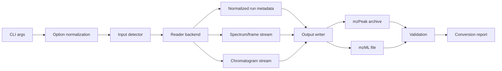

# BRFP Project Plan

This is the working architecture, implementation, and testing plan for the
Bruker Raw File Parser project.

Status date: 2026-06-18.

## Objectives

BRFP will be an open-source Rust application for converting Bruker `.d` raw data
directories into standards-compliant open formats.

Primary goals:

- Convert Bruker BAF, TDF, and TSF `.d` directories to mzPeak.
- Preserve acquisition metadata, spectra, chromatograms, precursor metadata,
  ion mobility information, calibration provenance, and software provenance.
- Support Linux and Windows production builds.
- Use Docker for SDK-backed development/testing from macOS.
- Keep proprietary Bruker SDK artifacts out of git and release archives.
- Require users to download Bruker SDK/runtime components directly from Bruker
  under Bruker's license terms.
- Provide enough validation that converted files can be trusted in downstream
  workflows.

Secondary goals:

- Write mzML for interoperability.
- Provide `inspect`, `query`, and `xic` subcommands inspired by
  ThermoRawFileParser.
- Provide reproducible conformance reports for releases.

Non-goals for the first production release:

- Native Bruker SDK execution on macOS.
- GUI.
- Vendor SDK redistribution in source control or release artifacts.
- Full mzPeak validator implementation if an upstream validator becomes
  available first.

## Platform Strategy

The bundled Bruker TDF/TSF SDK contains:

- `win64/timsdata.dll`
- `win64/timsdata.lib`
- `linux64/libtimsdata.so`

There is no macOS native SDK library. The Linux library is x86-64 ELF; the
Windows library is x86-64 PE. Therefore:

- macOS is a development platform for CLI, docs, SQLite metadata inspection,
  pure-Rust code, and host-side orchestration.
- SDK-backed work runs in Linux x86-64 Docker or on Windows x86-64.
- Apple Silicon Docker may use `--platform linux/amd64` and emulation. This is
  acceptable for correctness spikes but not for performance benchmarking.
- Classic BAF input uses `libbaf2sql_c.so`/`baf2sql_c.dll`, not the TDF-SDK
  `libtimsdata` API. On macOS, BRFP can inspect an already generated
  `analysis.sqlite` cache, but BAF array extraction runs in Docker/Linux or on
  Windows.

## Current Local Inputs

The workspace contains SDK archives and Bruker examples. They are ignored by
git.

- `timsdata-5_0_3.zip`: Bruker TDF/TSF SDK.
- `timsTOF_autoMSMS_Urine_6min_pos.d.zip`: TSF example.
- `timsTOF_autoMSMS_Urine_6min_neg.d.zip`: TSF example.
- `LTI225-41-3neg_1-D,5_01_24321.zip`: BAF + Waters/HyStar PDA example.
- `LTI225-67-3pos_1-F,2_01_24595.zip`: BAF + Waters/HyStar PDA example.

Extracted local paths:

- `vendor/timsdata`
- `fixtures/private/timsTOF_autoMSMS_Urine_6min_pos.d`
- `fixtures/private/timsTOF_autoMSMS_Urine_6min_neg.d`
- `tmp/baf-e2e/LTI225-41-3neg_1-D,5_01_24321.d`
- `tmp/baf-e2e/LTI225-67-3pos_1-F,2_01_24595.d`

The urine examples are TSF, not TDF. The LTI225 examples are BAF with PDA/UV
sidecars (`.u2`, `.unt`, `.hdx`, `.hss`). A TDF fixture is still needed for TDF
conversion acceptance.

## Architecture

The system is organized as a CLI pipeline over clear input and output boundaries.



### CLI Commands

Initial:

- `brfp inspect <input.d>`: detect format and summarize metadata.
- `brfp convert <input.d>`: convert to mzPeak by default.
- `brfp validate <output>`: validate mzPeak or mzML output.

Later:

- `brfp query <input-or-output> --scan ...`: return spectra as JSON/PROXI-like
  records.
- `brfp xic <input-or-output> --json filters.json`: return extracted ion
  chromatograms.
- `brfp batch <directory>` or `convert --input-directory`: convert multiple
  `.d` directories with isolated failure handling.

### Module Layout

Current single-crate layout:

- `cli`: command-line definitions.
- `input`: raw directory detection and SQLite metadata inspection.
- `pipeline`: command orchestration.
- `logging`: tracing setup.

Target single-crate modules before splitting:

- `config`: normalized CLI and environment configuration.
- `sdk`: SDK discovery and runtime capability checks.
- `input::detect`: `.d` format detection and structural validation.
- `input::metadata`: shared SQLite metadata readers.
- `input::tdf`: TDF reader adapter.
- `input::tsf`: TSF reader adapter.
- `model`: BRFP-facing records that are not already covered by upstream types.
- `output::mzpeak`: mzPeak writer adapter.
- `output::mzml`: mzML writer adapter.
- `validate::mzpeak`: integration wrapper around
  `okohlbacher/mzPeakValidator`.
- `validate::mzml`: integration wrapper around HUPO-PSI mzML validation
  tooling.
- `report`: conversion reports, warnings, and exit policy.

Split into workspace crates only after the first conversion path is working:

- `brfp-core`
- `brfp-cli`
- `brfp-bruker`
- `brfp-mzpeak`
- `brfp-mzml`
- `brfp-validate`

### Input Detection

For a given `.d` directory:

- BAF if `analysis.baf` exists and `analysis.sqlite` can be generated by
  `libbaf2sql_c` or already exists for inspection.
- TDF if `analysis.tdf` exists and `analysis.tdf_bin` is expected.
- TSF if `analysis.tsf` exists and `analysis.tsf_bin` is expected.
- Error if multiple analysis payloads exist.
- Error if no known payload exists.
- Warn if binary payload is missing.
- Read `GlobalMetadata.SchemaType` when present and verify it agrees with the
  file name.
- Read `GlobalMetadata.ClosedProperly`; warn or fail depending on
  `--warnings-are-errors`.

### Reader Backends

Backend priorities:

1. `mzdata` TDF reader for the first TDF-to-mzPeak path, because mzPeak writer
   already accepts `mzdata` data structures.
2. Direct BAF backend using the `libbaf2sql_c` cache/array API.
3. `timsrust-tsf` or Bruker SDK TSF reader for local examples.
4. Bruker SDK wrappers for calibration and functions not covered by pure Rust
   readers.
5. Direct SDK FFI only where existing Rust crates cannot provide the needed
   behavior.

Reader boundary:

```rust
trait RawRunReader {
    fn describe(&self) -> RunDescription;
    fn metadata(&self) -> RunMetadata;
    fn spectra(&mut self) -> SpectrumStream;
    fn chromatograms(&mut self) -> ChromatogramStream;
}
```

This trait is conceptual at first. Do not over-abstract before there are two
working backends. The actual first adapter can be pragmatic.

### Data Model

BRFP should not duplicate mature upstream data structures unless needed.

Use upstream types for:

- `mzdata` spectra, chromatograms, parameters, source files, instruments, and
  data-processing records.
- `timsrust` raw frame/spectrum types where direct TSF or SDK integration is
  needed.
- `mzpeak` writer-facing array schemas and metadata builders.

BRFP-owned records:

- `RunDescription`: path, format, schema version, frame count, spectrum count,
  peak count, acquisition mode summary, SDK capability, warnings.
- `ConversionOptions`: normalized options and defaults.
- `ConversionReport`: input, output, counts, warnings, timings, validator
  results, backend versions.
- `SdkDiscovery`: paths and load/build capability for SDK libraries.
- `ValidationFinding`: severity, location, message, and remediation hint.

### mzPeak Output Mapping

The mzPeak writer must produce a conformant archive:

- `mzpeak_index.json`
- `spectra_metadata.parquet`
- `spectra_peaks.parquet` for centroid data
- `spectra_data.parquet` only for profile data
- `chromatograms_metadata.parquet` and `chromatograms_data.parquet` when
  chromatograms are included

Rules:

- Declare every CV prefix in `cv_list`.
- Record file-level metadata in `mzpeak_index.json` and Parquet metadata where
  the writer supports it.
- Use the array index for every signal column.
- Do not rely on column names for semantic interpretation.
- Write page indexes for coordinate and entity index columns.
- Treat timsTOF-style m/z-centroided data as peak data for mzPeak placement.
- Preserve scan windows, precursor references, selected ions, collision energy,
  polarity, retention time, and ion mobility.
- Add BRFP conversion software and processing method metadata.

Default mzPeak settings:

- Chunked layout for signal data where supported.
- m/z chunk width 50.
- Zstd compression level 3.
- m/z as float64 initially.
- ion mobility as float64 initially.
- intensity as float32 initially unless source precision requires another type.

### mzML Output Mapping

mzML is secondary. Implement after mzPeak conversion is validated.

Rules:

- Use `mzdata` writer APIs if practical.
- Keep native IDs stable.
- Preserve ion mobility arrays and relevant CV terms.
- Support indexed mzML if the writer API makes it straightforward.
- Use mzML output in tests as an interoperability check, not as the primary
  canonical output.

### SDK Boundary

SDK-backed functionality must be explicit.

Inputs:

- `--sdk-lib-dir <path>`
- `TIMSDATA_LIB_DIR`
- Docker mount at `/work/vendor/timsdata/linux64`

Checks:

- Verify library file exists.
- Verify platform compatibility.
- In Docker/Linux, verify `ldd` can resolve dependencies.
- Run a minimal SDK smoke call against a TSF/TDF fixture before enabling
  SDK-dependent conversion code.

Design choice:

- Prefer existing crates (`timsrust-sdk`, `timsrust-tsf`, `mzdata`) over custom
  FFI.
- Add custom FFI only for missing API calls or if build-time linking becomes too
  brittle.

## Implementation Plan

### Phase A: Repository And Planning Baseline

Done:

- Rust CLI scaffold.
- Inspect command for TDF/TSF SQLite metadata.
- SDK and fixtures ignored.
- Architecture, roadmap, testing docs.

Remaining:

- Commit baseline.
- Add CI skeleton.
- Add Docker SDK helper scripts.

### Phase B: Docker SDK Smoke Testing

Goal: prove SDK can run in the available Docker environment.

Tasks:

- Add a Docker helper script or documented command for `linux/amd64`.
- Add a Rust feature flag for SDK smoke tests, or a standalone example binary.
- Compile/run inside Docker with `TIMSDATA_LIB_DIR=/work/vendor/timsdata/linux64`.
- Call a minimal SDK path on one TSF fixture.
- Record SDK version/changelog in the report.

Acceptance:

- Host command can run Docker and execute a reproducible SDK smoke test.
- The test is skipped by default on macOS host tests.
- Failure modes are clear when Docker, SDK, or fixture paths are missing.

### Phase C: TSF Reader Spike

Goal: convert the provided TSF examples far enough to enumerate spectra and
metadata.

Tasks:

- Evaluate `timsrust-tsf` public API against local examples.
- If sufficient, implement `input::tsf` using `timsrust-tsf`.
- If not sufficient, use SDK Python/C examples to identify required C calls,
  then decide between `timsrust-sdk` or a narrow FFI wrapper.
- Build a minimal spectrum stream with m/z, intensity, frame metadata, and MS/MS
  metadata from `FrameMsMsInfo`.
- Add tests gated by private fixtures.

Acceptance:

- Program can read first N spectra from both TSF examples in Docker/Linux.
- Counts match `inspect`.
- Metadata includes polarity, RT, MS/MS type, precursor trigger mass, isolation
  width, charge, and collision energy where present.

### Phase D: mzPeak Writer Spike

Goal: write a minimal mzPeak archive from a small stream.

Tasks:

- Add HUPO-PSI/mzPeak as a git/path dependency.
- Build an adapter that writes `mzdata`-like records into mzPeak.
- Start with centroid/peak output in `spectra_peaks.parquet`.
- Add file-level metadata and BRFP software provenance.
- Add TIC/BPC chromatograms if available.
- Reopen output with the mzPeak Rust reader.

Acceptance:

- Minimal synthetic spectrum stream writes and reopens.
- TSF first-N spectra writes and reopens in Docker.
- Output contains expected mzPeak members and metadata.

### Phase E: TDF Reader And Conversion

Goal: TDF `.d` to mzPeak using `mzdata`.

Tasks:

- Add a TDF fixture.
- Enable `mzdata` with `bruker_tdf`, `serde`, `nalgebra`, `zstd`, `numpress`.
- Implement TDF conversion via `mzdata::io::MZReaderType`.
- Ensure ion mobility dimensions are preserved.
- Validate DDA-PASEF and DIA-PASEF metadata mapping.

Acceptance:

- One TDF fixture converts to mzPeak.
- Output reopens with mzPeak reader.
- Frame/spectrum/chromatogram counts match.
- Representative precursor/window metadata matches source SQL.

### Phase F: Validation

Goal: make conversion failures visible and actionable.

Tasks:

- Integrate `okohlbacher/mzPeakValidator` as the mzPeak conformance gate.
- Store `mzpeak-validate --json` reports in conversion reports or adjacent
  artifacts when requested.
- Validate `mzpeak_index.json` structure.
- Validate required archive members by entity/data kind.
- Validate Parquet schema and array index metadata.
- Validate semantic invariants:
  - spectrum indices are contiguous
  - foreign keys resolve
  - chunk ranges are sorted and non-overlapping
  - coordinate arrays are sorted where required
  - CV prefixes used are declared

Acceptance:

- `brfp validate <file.mzpeak>` catches corrupted/missing required pieces.
- Conversion can optionally run validation after write.
- Generated mzPeak files pass `mzpeak-validate` or surface its findings.

### Phase G: mzML Output

Goal: provide interoperability output.

Tasks:

- Implement mzML writer adapter.
- Add indexed mzML option if practical.
- Add compression option.
- Validate output with HUPO-PSI mzML tooling and keep `mzdata` round-trip reads
  as an additional smoke check.

Acceptance:

- mzML passes HUPO-PSI validation and opens in at least one independent reader.
- Counts and representative spectra match mzPeak output.

### Phase H: Query And XIC

Goal: provide ThermoRawFileParser-inspired utility commands.

Tasks:

- Implement `query` by index/native id/time.
- Return JSON with metadata and arrays, optionally PROXI-compatible.
- Implement XIC filters:
  - m/z plus ppm/Da tolerance
  - m/z range
  - RT range
  - MS level/filter constraints
- Support mzPeak input first, raw input later if feasible.

Acceptance:

- Deterministic query output on fixtures.
- XIC output validates against golden semantic expectations.

### Phase I: Release Engineering

Goal: make the project distributable.

Tasks:

- GitHub repository under `okohlbacher`.
- CI for Linux and Windows.
- Docker workflow for SDK-gated tests.
- Release artifacts for Linux and Windows.
- Dependency license report.
- SDK setup documentation.
- Versioned conformance report per release.

Acceptance:

- Release can be installed and run on Linux and Windows.
- CI passes without proprietary SDK.
- SDK tests are opt-in and documented.

## Testing Plan

### Test Matrix

Local host tests:

- CLI parsing.
- Input detection.
- SQLite inspection.
- Synthetic writer/validator tests.

Docker SDK tests:

- SDK discovery.
- SDK smoke calls.
- TSF reader against private fixtures.
- SDK-backed conversion when implemented.

Linux CI tests:

- Unit tests.
- Pure-Rust integration tests.
- No proprietary SDK required.

Windows CI tests:

- Unit tests.
- Pure-Rust integration tests.
- Optional SDK job on self-hosted runner or explicit SDK setup.

Private fixture tests:

- Provided TSF positive and negative runs.
- Future TDF DDA-PASEF fixture.
- Future TDF DIA-PASEF fixture.
- Large performance fixtures.

### Unit Tests

Required:

- CLI defaults and option parsing.
- Output path derivation.
- Input detection edge cases.
- SQLite table discovery and frame summaries.
- Warning policy and `--warnings-are-errors`.
- SDK path discovery logic.
- Conversion report serialization.

### Integration Tests

Required:

- Inspect local TSF examples when `BRFP_TEST_PRIVATE_DATA` is set.
- Docker SDK smoke test when `BRFP_TEST_SDK=1`.
- Convert synthetic spectra to mzPeak.
- Convert first N TSF spectra to mzPeak when SDK/TSF backend is ready.
- Convert TDF fixture to mzPeak when fixture is available.

### Validation Tests

Required:

- Missing `mzpeak_index.json` fails.
- Missing referenced Parquet member fails.
- Missing CV declaration fails.
- Broken foreign key fails.
- Unsorted rank-0 coordinate fails.
- Overlapping chunks fail.
- Valid minimal archive passes.

### Golden/Semantic Comparison

Prefer semantic assertions over byte-for-byte golden files:

- Same spectrum count.
- Same chromatogram count.
- Same native IDs.
- Retention times within tolerance.
- m/z and intensity arrays within selected precision tolerance.
- Ion mobility arrays within tolerance.
- Same precursor and scan-window metadata.

Byte-for-byte golden files are acceptable only for tiny synthetic fixtures with
fully pinned writer settings.

### Performance Tests

Metrics:

- Spectra per second.
- Points/peaks per second.
- Peak memory usage.
- Output size by format/layout/compression.
- Random access read latency from mzPeak.

Rules:

- Run performance tests on native Linux x86-64, not Apple Silicon emulation.
- Do not make performance tests part of normal CI.
- Store benchmark reports as release artifacts.

## Risk Register

High risks:

- mzPeak spec and Rust APIs are still changing.
- Local examples are TSF, while initial reader plan focused on TDF.
- SDK is not macOS-native.
- Bruker SDK files cannot be redistributed with BRFP.
- Public raw data fixtures may be hard to redistribute.
- No TDF fixture is currently available in the workspace.
- SDK-backed code can bit-rot unless compiled in Docker or native Linux/Windows.
- Dependency conflicts are likely around Arrow/Parquet versions.
- Conversion output may not be deterministic unless ordering, timestamps, chunk
  boundaries, and compression settings are controlled.
- Large conversions need progress, cancellation, and partial-output cleanup.

Mitigations:

- Pin git dependencies by commit.
- Isolate SDK usage and make it opt-in.
- Document SDK download/discovery instead of bundling proprietary files.
- Keep fixtures private until licensing is confirmed.
- Add TDF fixture acquisition as a blocking milestone for TDF release claims.
- Use semantic validation rather than assuming writer success.
- Add a Docker SDK smoke path before SDK-backed conversion work.
- Add a dependency-conflict spike before committing to mzPeak/mzdata/timsrust
  versions.
- Define deterministic-output and conversion-report policy before conformance
  claims.

## Immediate Work Chunks

Parallel-safe now:

- Docker SDK smoke helper.
- Input detection/report hardening.
- Private fixture test gating.
- Work-breakdown issue list.
- mzPeak dependency spike in a separate branch or feature gate.
- SDK discovery and integrity checks.
- Negative fixture generation for malformed `.d` directories.

Not parallel-safe until decisions are made:

- Deep TSF conversion API design.
- mzPeak writer adapter details.
- Workspace crate split.
