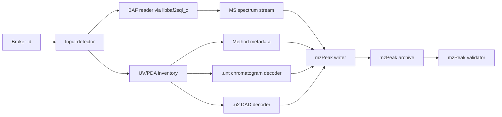

# BAF And UV/PDA Conversion Strategy

Analysis date: 2026-06-18.

This document records what `gtluu/timsconvert`, `mafreitas/tdf2mzml`, and the
two local BAF/PDA datasets imply for BRFP conversion design. The scope is BAF
mass spectra plus Waters ACQUITY PDA/UV detector sidecars in Bruker HyStar `.d`
directories.

Implementation update: BRFP now decodes validated `.u2` DAD/PDA records into
mzPeak wavelength-spectrum parquet facets, derives method-wavelength absorption
chromatograms from those decoded spectra, and forwards vendor metadata only.
Raw detector files are intentionally not embedded in mzPeak archives.

## Sources Reviewed

- `gtluu/timsconvert`, cloned to `tmp/timsconvert`.
- `mafreitas/tdf2mzml`, cloned to `tmp/tdf2mzml`.
- Local datasets:
  - `tmp/data-explore/LTI225-41-3neg_1-D,5_01_24321.d`
  - `tmp/data-explore/LTI225-67-3pos_1-F,2_01_24595.d`
- Current mzPeak Rust dependency in Cargo cache, especially its writer and reader
  wavelength-spectrum paths.
- Public Bruker/Waters HyStar material for context. No public `.u2`/`.unt`
  binary format specification was found.

## Converter Findings

### TIMSCONVERT

`timsconvert` is useful as an option and workflow reference, but less useful as
a direct BAF implementation template.

Relevant behavior:

- Detects BAF, TSF, and TDF and dispatches to LC-MS or MALDI writers.
- Uses `pyBaf2Sql` for BAF via `TimsconvertBafData` and `BafSpectrum`.
- Exposes options worth mirroring where they fit BRFP:
  `--mode raw|centroid|profile`, `--compression`, `--ms2_only`,
  `--use_raw_calibration`, `--pressure_compensation_strategy`,
  `--exclude_mobility`, array encodings, and `--profile_bins`.
- Does not implement a UV/PDA/DAD sidecar decoder. References to
  chromatograms are MS chromatograms/mobilograms, not optical detector data.

### tdf2mzml

`tdf2mzml` is the better BAF implementation reference because its BAF layer is
small, direct, and does not hide the SQL schema behind a higher-level object.

Relevant behavior:

- Supports TDF, TSF, and BAF.
- Uses a low-level ctypes wrapper around `libbaf2sql_c.so`:
  `baf2sql_get_sqlite_cache_filename_v2`,
  `baf2sql_array_open_storage`, `baf2sql_array_get_num_elements`, and
  `baf2sql_array_read_double`.
- Reads BAF metadata from the generated SQLite cache:
  `Spectra`, `AcquisitionKeys`, `Properties`, `Steps`,
  `SupportedVariables`, and `Variables`.
- Enumerates spectra with this core query shape:
  `Spectra` joined to `AcquisitionKeys`, ordered by `Spectra.Id`, reading
  `Rt`, `Parent`, m/z range, line/profile array IDs, MS level, and polarity.
- Resolves MS2 precursor mass from `Steps` and collision energy/isolation width
  from `Variables` using `SupportedVariables.PermanentName`.
- Does not implement a UV/PDA/DAD sidecar decoder.

## Local Dataset Findings

Both new datasets are classic Bruker BAF `.d` directories with HyStar LC/PDA
sidecars.

Mass-spectrometry files:

- `analysis.baf`
- `analysis.baf_idx`
- `analysis.baf_xtr`

Detector and method files:

- `<sample>.unt`
- `<sample>.u2`
- `<sample>.hdx`
- `LCParms.txt`
- `SampleInfo.xml`
- `otofq-w bsm-sm-pda.hss`

`LCParms.txt` says:

- Runtime: `15.02 min`.
- Slice width: `50.0 points/s`.
- Detector: `Waters ACQUITY UPLC`.
- Three fixed wavelength signals: `220`, `254`, and `360` nm.
- PDA settings include spectral start `190.00`, spectral end `500.00`, unit
  context `mAU`, and `DoSaveSpectra: no`.

`*.hdx` is a text index and maps:

- `CHROMATOGRAM` to the `.unt` file.
- `UV.DAD` to the `.u2` file.
- Both UV and MS start at `0.0 min`.

`*.hss` is XML and identifies the Waters ACQUITY PDA detector and DAD limits.
The local files expose an `AcquityPDAConfig`, detector serial number, firmware,
and DAD category limits including wavelength bounds.

Binary header observations:

- `.u2` begins with `#BFALCCHROM#`.
- `.u2` offset `0x20` appears to be a 512-byte header length.
- `.u2` offset `0x24` is `622`, likely the number of wavelength bins.
- `.u2` offsets `0x28`, `0x30`, and `0x38` decode as little-endian doubles:
  `190.0`, `500.0`, and `50.0`.
- `.u2` stores unit text `mAU` in the header.
- `.unt` also begins with `#BFALCCHROM#`, embeds HyStar method text, and has
  a candidate little-endian float32 time axis starting near offset `17840`.
  The observed step is about `0.000833333 min` (`0.05 s`, 20 Hz), but this is
  not yet sufficient to claim a decoder.

Docker BAF cache inspection with `libbaf2sql_c.so`:

- The library runs under Linux/amd64 Docker. macOS cannot load the Linux `.so`.
- Both datasets generate `analysis.sqlite`.
- Calibrated array opening fails on both old QTOF datasets with
  `CReferenceCalibrators::ExtractFromBlob: this AMI contains problematic information.`
- Raw-calibration array opening succeeds with `baf2sql_array_open_storage(1, ...)`.
- Negative dataset:
  - `Spectra`: `2674`
  - `AcquisitionKeys`: one key, `MsLevel=0`, `Polarity=1`
  - Interpretation: MS1-only negative acquisition.
- Positive dataset:
  - `Spectra`: `2675`
  - `AcquisitionKeys`: one key, `MsLevel=0`, `Polarity=0`
  - Interpretation: MS1-only positive acquisition.

## BAF Backend Strategy

BRFP should implement BAF as a separate backend. Do not try to route BAF through
TDF-SDK; Bruker TDF-SDK is for TDF/TSF, while BAF needs `libbaf2sql_c`.

Proposed modules:

- `src/baf_ffi.rs`: dynamic `libloading` wrapper for `libbaf2sql_c.so` and
  `baf2sql_c.dll`.
- `src/baf_sql.rs`: generated SQLite cache access and typed row models.
- `src/baf_reader.rs`: BRFP `RawRunReader` implementation for BAF.
- `src/baf_arrays.rs`: array-store wrapper around line/profile m/z and
  intensity array IDs.

Runtime library discovery:

- `--sdk-lib-dir <path>` should search for both `libtimsdata` and `libbaf2sql_c`
  family libraries.
- Environment fallback:
  - `BRFP_BRUKER_SDK_DIR`
  - `BRFP_BAF2SQL_LIB`
  - platform loader paths (`LD_LIBRARY_PATH`, `PATH`)
- Do not commit Bruker SDK binaries.
- Emit the resolved library path and SDK function availability in `inspect`.
- Record dependent-library failures separately from missing primary-library
  failures. On Linux, `libbaf2sql_c.so` depends on libraries such as `libgomp`.
- Windows DLL loading must be tested explicitly; do not assume Linux
  `LD_LIBRARY_PATH` behavior maps to `PATH` or `SetDllDirectory` behavior.

Reader flow:

1. Detect `analysis.baf` before TSF/TDF fallback when no `analysis.tdf` exists.
2. Call `baf2sql_get_sqlite_cache_filename_v2` to create/find
   `analysis.sqlite`.
3. Open SQLite read-only when possible.
4. Load run metadata from `Properties`, `Info`, `AcquisitionKeys`, and summary
   queries on `Spectra`.
5. Open the array store:
   - `vendor` mode: calibrated arrays only.
   - `raw` mode: raw arrays only.
   - `auto` mode: try calibrated, then fall back to raw with a warning.
6. Enumerate spectra ordered by `Spectra.Id`.
7. Prefer line arrays for centroid output; use profile arrays only when the user
   requests profile/raw mode and they exist.
8. Resolve MS2 precursor metadata from `Steps` and `Variables` when present.
9. Stream spectra directly into the mzPeak writer.

SQLite cache requirements:

- Detect stale caches by comparing `analysis.sqlite` mtime/size provenance
  against `analysis.baf`, `analysis.baf_idx`, and `analysis.baf_xtr`.
- If cache regeneration is required but the analysis directory is read-only,
  fail with a diagnostic that points to a writable copy or cache directory.
- Treat `analysis.baf_idx` and `analysis.baf_xtr` as source files for
  provenance/checksums even if `libbaf2sql_c` handles them internally.
- Add negative tests for missing, locked, corrupt, and stale caches.

Important mappings:

- `AcquisitionKeys.MsLevel = 0` means MS1 in BAF caches observed here and in
  `tdf2mzml`.
- `AcquisitionKeys.Polarity = 0` maps to positive scan.
- `AcquisitionKeys.Polarity = 1` maps to negative scan.
- `Spectra.Rt` is seconds. mzML-style scan start time should be minutes where
  required by `mzdata`, but mzPeak metadata should retain the unit explicitly.
- `LineMzId`/`LineIntensityId` are centroid-like arrays.
- `ProfileMzId`/`ProfileIntensityId` are profile arrays and may be absent after
  the first spectrum in these datasets.

Profile-mode behavior:

- If profile mode is requested and a spectrum lacks profile arrays, BRFP should
  either fall back to line arrays with a warning in `auto` mode or fail in
  strict profile mode.
- The CLI should expose this as `--profile-missing auto|line|fail`, default
  `auto`.

Calibration behavior:

- Raw-calibration fallback must be visible in the conversion report, mzPeak
  provenance, and validator-side JSON report.
- Raw fallback is an access strategy, not an assertion that the data are
  equivalent to calibrated arrays. The warning should state that calibrated BAF
  array access failed and raw arrays were used.
- Add fixture tests where calibrated open succeeds and where raw fallback is
  required.

CLI alignment:

- Reuse current ThermoRawFileParser-compatible `-i`, `-b`, `-f`, `-L`,
  `-p|--noPeakPicking`, `-a|--allDetectors`, `--vendor-metadata`, and
  `--vendor-metadata-json`.
- Add Bruker-specific but converter-compatible aliases:
  - `--mode raw|centroid|profile` as an alias for the current peak mode where
    possible.
  - `--ms2-only`.
  - `--use-raw-calibration`.
  - `--calibration-mode auto|vendor|raw`, default `auto`.
  - `--start-frame` and `--end-frame` accepted as aliases for spectrum ID range
    in BAF and frame range in TDF/TSF.

## UV/PDA Strategy

The UV/PDA path must be independent of both BAF and TDF SDK readers. The sidecar
files are LC detector artifacts produced by HyStar/Waters integration, not mass
spectra in BAF.

Target behavior:

- `--allDetectors` should include all detector evidence.
- If decoding succeeds, BRFP writes decoded detector streams into mzPeak data
  structures and metadata rows for source provenance.
- If decoding is not yet verified, BRFP writes explicit vendor metadata rows and
  warns that decoded detector entries were skipped.
- `--vendor-metadata` remains file-level metadata export and should not be
  required for decoded UV output.
- Partial decode behavior should be deterministic:
  - `.u2` success writes wavelength spectra and, when method wavelengths are
    available, derived absorption chromatograms.
  - `.u2` failure writes metadata-only provenance and one detector warning.
  - `.unt` direct decoding remains disabled until independently validated.
  - Any decoded stream must identify whether acquisition times are explicit or
    inferred.

Proposed modules:

- `src/uv_inventory.rs`: discover `.hdx`, `.unt`, `.u2`, `.hss`, `LCParms.txt`,
  and classify their roles.
- `src/uv_method.rs`: parse `LCParms.txt` and `.hss` into method metadata,
  channel wavelengths, detector identity, runtime, sampling hints, and offsets.
- `src/uv_unt.rs`: decode fixed-wavelength chromatograms from `.unt`.
- `src/uv_u2.rs`: decode DAD/PDA wavelength spectra from `.u2`.
- `src/uv_mzpeak.rs`: convert decoded UV records into mzPeak chromatograms and
  wavelength-spectrum entries.

Data structures:

```rust
struct UvDetectorInventory {
    hdx: Option<PathBuf>,
    chromatogram_file: Option<PathBuf>,
    dad_file: Option<PathBuf>,
    hardware_setup: Option<PathBuf>,
    lc_parameters: Option<PathBuf>,
}

struct UvMethod {
    detector_name: Option<String>,
    detector_serial: Option<String>,
    runtime_minutes: Option<f64>,
    slice_width_points_per_second: Option<f64>,
    channels: Vec<UvChannel>,
    spectral_start_nm: Option<f64>,
    spectral_end_nm: Option<f64>,
    ms_offset_seconds: Option<f64>,
}

struct UvChannel {
    index: u32,
    wavelength_nm: f64,
    source_label: String,
}

struct UvChromatogram {
    id: String,
    wavelength_nm: f64,
    time_minutes: Vec<f64>,
    absorbance_mau: Vec<f32>,
}

struct DadSpectrum {
    id: String,
    time_minutes: f64,
    wavelengths_nm: Vec<f64>,
    absorbance_mau: Vec<f32>,
}
```

`.unt` decoder approach:

1. Parse and preserve the embedded HyStar method text.
2. Find a validated time axis by scanning for monotonic little-endian float32 or
   float64 values with plausible runtime bounds.
3. Use method channels (`220`, `254`, `360` nm in the local datasets) to test
   candidate intensity block layouts.
4. Accept a candidate only if:
   - all channel arrays have equal length,
   - time spans match method runtime within tolerance,
   - intensities are finite and plausibly mAU,
   - channel count matches `LCParms.txt`, and
   - both new datasets decode with the same structural rule.
5. Until those checks pass, keep `.unt` as metadata-only provenance and do not
   embed the raw detector file.

`.u2` decoder approach:

1. Validate magic `#BFALCCHROM#`.
2. Decode header fields:
   - header length,
   - wavelength count,
   - wavelength lower/upper bounds,
   - unit text.
3. Infer wavelength grid from `start_nm`, `end_nm`, and `wavelength_count`.
4. Search payload layouts with explicit scoring:
   - contiguous spectra of `f32` or `f64` intensities,
   - optional per-spectrum time/index fields,
   - optional block headers or padding,
   - runtime consistency against `LCParms.txt`.
5. Require the same layout to decode both local datasets.
6. Emit DAD spectra only after the layout is deterministic and validated.

Open `.u2` contradiction:

- `LCParms.txt` says `DoSaveSpectra: no`, yet `.hdx` references `UV.DAD` and
  a `.u2` file exists. Before writing decoded DAD spectra, prove whether `.u2`
  contains full PDA spectra, a derived matrix, or only metadata/placeholder
  blocks.
- If `.u2` does not contain true spectra for a future acquisition variant, BRFP
  should skip decoded DAD output for that file and report the parser status in
  vendor metadata rather than embedding the raw detector file.

The current mzPeak Rust writer already supports wavelength-spectrum facets and
round-trips an mzML fixture with `ArrayType::WavelengthArray`. BRFP should use
that path for decoded `.u2` spectra instead of inventing a proprietary mzPeak
facet.

Mapping to mzPeak:

- Fixed-wavelength UV traces from `.unt`:
  - mzPeak chromatograms with time array and absorbance/intensity array.
  - IDs like `uv chromatogram wavelength=254`.
  - Parameters for detector name, wavelength, unit `mAU`, source file, and
    channel index.
- DAD/PDA spectra from `.u2`:
  - mzPeak wavelength-spectrum entries.
  - Arrays:
    - `ArrayType::WavelengthArray`, unit nanometer, sorted rank 0.
    - intensity/absorbance array, unit `mAU` where supported or a controlled
      user param if no CV mapping exists.
  - IDs like `uv spectrum index=1234`.
  - Acquisition time from decoded time axis or inferred from runtime/sample
    index, marked as inferred if not explicitly stored.
- Raw files:
  - Do not embed `.unt`, `.u2`, `.hdx`, `.hss`, `LCParms.txt`, or related method
    files as archive sidecars.
  - Include original path, size, parser status, and decoded-stream counts in
    `vendor_file_metadata.parquet`.

Sidecar robustness:

- `.hdx` should be preferred for file association, but the inventory should
  fall back to file-name patterns when `.hdx` is missing.
- `.hss` parsing should be tolerant XML parsing; unknown detector blocks should
  be preserved as vendor metadata instead of causing conversion failure.
- Validate configured UV channel wavelengths against decoded wavelength bounds.

## Data Flow



## Implementation Chunks

1. BAF detection and `inspect`:
   - Detect `analysis.baf`.
   - Generate/open `analysis.sqlite` in Docker/Linux.
   - Report BAF schema, spectrum counts, polarity, software, and calibration
     mode.
2. BAF array FFI:
   - Implement dynamic wrapper for `libbaf2sql_c`.
   - Add auto calibrated/raw fallback with warning.
   - Ensure every opened storage handle is closed exactly once.
   - Copy SDK-returned arrays into Rust-owned buffers before the handle is
     closed.
   - Add unit tests for error translation and integration tests gated by
     `BRFP_TEST_BAF_DATA`.
3. BAF mzPeak conversion:
   - Convert line spectra first.
   - Add profile mode after centroid path validates.
   - Add precursor mapping for MS2 datasets when supplied.
4. UV inventory and metadata:
   - Parse `.hdx`, `LCParms.txt`, and `.hss`.
   - Extend vendor metadata rows with detector role, channel wavelengths,
     file checksums, and parser status.
5. `.unt` chromatogram decoder:
   - Build a standalone decoder with debug dumps.
   - Gate decoded output behind strict structural validation.
6. `.u2` DAD decoder:
   - Parse header, infer matrix layout, and emit decoded spectra only after both
     local datasets pass the same rule.
7. mzPeak UV writing:
   - Write fixed UV traces as chromatograms.
   - Write DAD spectra as mzPeak wavelength spectra.
   - Keep raw detector files out of the mzPeak archive.
8. Validation and comparison:
   - Run `mzpeak-validate` on every generated archive.
   - Verify MS spectrum counts against BAF SQL.
   - Verify UV channel count and wavelengths against `LCParms.txt`.
   - Verify wavelength-spectrum count, wavelength bounds, and array lengths.
   - Compare BAF mass spectra against `tdf2mzml` mzML output for at least one
     dataset when the Python converter can run in the same Docker image.

## Acceptance Criteria

BAF:

- `brfp inspect <BAF.d>` reports `BAF`, spectrum count, polarity, acquisition
  software, and whether calibrated or raw arrays will be used.
- The two local datasets convert to mzPeak with `2674` and `2675` mass spectra,
  respectively.
- The generated mzPeak archives pass `mzpeak-validate`.
- If calibrated array opening fails, conversion succeeds in `auto` mode and
  records a warning plus raw-calibration provenance.
- Profile mode behavior is deterministic when profile arrays are absent after
  the first spectrum.

UV/PDA:

- `brfp convert -a --vendor-metadata <BAF.d>` decodes supported detector data
  into mzPeak detector facets without writing `vendor_payloads/` entries.
- The archive records detector metadata including Waters ACQUITY PDA identity
  and the configured wavelengths `220`, `254`, and `360` nm.
- The output contains mzPeak wavelength spectra with wavelength arrays spanning
  the decoded range and raw UV intensity units recorded as mAU.
- The output contains method-wavelength absorption chromatograms derived from
  decoded `.u2` spectra, with matching time axes and wavelength metadata.
- If `.u2` proves not to contain true saved PDA spectra for a future file,
  decoded DAD output stays disabled and metadata-only provenance is the accepted
  behavior.

## Main Risks

- `.u2` and `.unt` are proprietary formats without a public binary spec. The
  decoder must remain conservative and fixture-driven.
- Old BAF files may require raw calibration fallback. Newer files may behave
  differently, so both calibrated and raw paths need tests.
- The mzPeak validator may currently focus on MS spectra; wavelength-spectrum
  validation expectations should be checked against `okohlbacher/mzPeakValidator`
  before declaring decoded UV support complete.
- Bruker SDK licensing prevents bundling proprietary libraries. Linux and
  Windows releases must document installation and discovery, not ship SDK
  binaries.

## Adversarial Review Follow-Ups

Kimi and Vibe both reviewed this strategy after drafting. Concrete follow-ups to
track as implementation requirements:

- Add MS2 BAF fixtures before claiming precursor support.
- Validate polarity and MS-level enum mappings against more than the two local
  MS1-only BAF files.
- Make calibrated/raw fallback a reported provenance event, not a silent access
  detail.
- Define profile-array absence behavior before exposing `--mode profile`.
- Add stale/corrupt/locked SQLite cache tests.
- Treat `.baf_idx` and `.baf_xtr` as provenance-bearing source files.
- Resolve the `LCParms.txt` `DoSaveSpectra: no` versus `.u2` presence issue
  before enabling DAD-spectrum output.
- Define UV/MS time alignment and explicit-versus-inferred retention time rules.
- Add Docker-based BAF development commands because native macOS cannot load
  the Linux BAF SDK library.
- Add negative tests for missing/malformed `.hdx`, `.hss`, `.unt`, and `.u2`.
